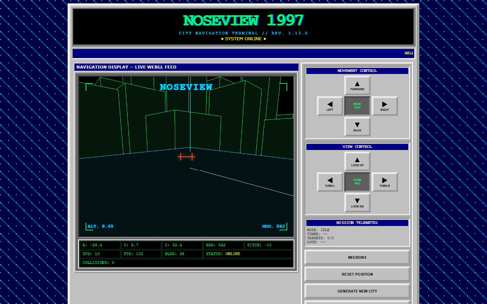

# NOSEVIEW 1997

Fly a neon wireframe city, hunt rooftop transmissions, and survive long enough to
find your way home — all inside a deliberately overbuilt 1997-style navigation
terminal.

## [▶ PLAY LIVE](https://bloschinsky.github.io/noseview-city-1997/)

[](https://bloschinsky.github.io/noseview-city-1997/)

[Watch the 7-second flight demo captured during Signal Hunt (WebM, 180 KB).](docs/media/v1.13.0-flight-and-signal-hunt.webm)

```text
 _   _  ___  ____  _____ _   _ ___ _____ _    _
| \ | |/ _ \/ ___|| ____| | | |_ _| ____| |  | |
|  \| | | | \___ \|  _| | | | || ||  _| | |  | |
| |\  | |_| |___) | |___ \ V / | || |___| |__| |
|_| \_|\___/|____/|_____| \_/ |___|_____|\____/
             C I T Y   T E R M I N A L   1 9 9 7
```

NOSEVIEW 1997 is a compact retro-futuristic flight game with deterministic
procedural cities, accessible controls, optional survival systems, and a timed
Signal Hunt mission. The entire experience is plain HTML, CSS, JavaScript, and
WebGL: no framework, dependency, build step, server, account, cookies, or
tracking.

## Features

- Free flight through a three-dimensional city
- Three deterministic procedural landmarks in every 26-structure city
- Normalized collision records for building walls, rooftops, landmarks, and ground contact
- Optional Hull Integrity survival rules with collision damage and an accessible restart flow
- Optional Fuel Endurance with deterministic ground/rooftop pickups and shared survival restart
- Ground-floor protection and automatic navigation-boundary recovery
- Three speed modes and procedural city regeneration
- HUD with position, altitude, heading, pitch, and FPS data
- Optional `ANALOG VISION` with scanlines, a sweeping beam, glow, and signal noise
- Mutually exclusive green Digital Rain or static white WebGL Starfield backgrounds (both off by default)
- Optional procedurally synthesized AdLib-style background music
- Procedural retro attention, countdown, and automatic-return audio cues
- Responsive keyboard and on-screen controls

### Missions and Signal Hunt (completed in 1.11.3)

- Open `MISSIONS` in the right panel to view the implemented mission directory. Free Flight remains the default and never requires choosing a mission.
- Start Signal Hunt from its catalog entry. While it is active, reopen `MISSIONS` to abort; after completion, failure, or abort, reopen it to replay. Starting, replaying, or aborting returns focus to the flight display.
- Each city/mission seed deterministically selects three to five reachable rooftop signals outside the helipad spawn area.
- Aim the center crosshair at the active rooftop transmitter and hold it there for two continuous seconds; its cyan wireframe box, antenna, and four horizontal signal waves emitted from the antenna crossbar show acquisition progress alongside the corner lock frame and text feedback.
- Acquired signals remain marked while a hunt is active. Beacon animation becomes static when reduced motion is requested.
- Acquire all targets before time runs out to open an accessible `MISSION COMPLETE` dialog with the target count, elapsed time, replay, and new-city controls.
- `ABORT MISSION` exits early. After success/failure/abort, the `START` button becomes `REPLAY MISSION`.
- During an active mission, `RESET POSITION` / `R` restarts the attempt (timer and progress reset) at the helipad pose.
- Generating a city during an active hunt creates a fresh route for that city; generating one after a terminal mission returns to Free Flight.

## System Requirements

NOSEVIEW 1997 has no operating-system-specific code. The practical minimum is a browser that supports WebGL 1.0, Canvas 2D, Pointer Events, modern JavaScript, and CSS `aspect-ratio`. Web Audio is optional and is only required for music.

### Browser Compatibility

| Platform | Browser | Minimum version |
| --- | --- | ---: |
| Desktop | Google Chrome | 88 |
| Desktop | Microsoft Edge (Chromium) | 88 |
| Desktop | Mozilla Firefox | 89 |
| Desktop | Apple Safari | 15 |
| Desktop | Other Chromium-based browsers | Chromium 88 engine |
| Android | Google Chrome / Android System WebView | 88 |
| Android | Mozilla Firefox | 89 |
| Android | Samsung Internet | 15 |
| iPhone / iPad | Safari and other WebKit-based browsers | iOS / iPadOS 15 |

These versions are a feature-derived compatibility baseline rather than an exhaustive test matrix. Use the latest browser version available for security, driver compatibility, and performance. Internet Explorer and legacy EdgeHTML are not supported.

### Hardware and Environment

- A GPU and driver capable of WebGL 1.0 (OpenGL ES 2.0-class graphics or equivalent); hardware acceleration should be enabled.
- Any CPU and memory configuration capable of running one supported browser tab. Integrated graphics are sufficient; no discrete GPU is required.
- JavaScript enabled and a viewport at least 320 CSS pixels wide.
- A keyboard on desktop or a pointer/touchscreen on mobile.
- An audio output device and Web Audio support only if music is enabled.
- No installation, build tools, web server, or network connection is required after the project files are available.

The browser floor is primarily set by CSS `aspect-ratio`: it arrived in [Chrome 88](https://developer.chrome.com/blog/new-in-chrome-88), [Firefox 89](https://developer.mozilla.org/en-US/docs/Mozilla/Firefox/Releases/89), and [Safari 15](https://webkit.org/blog/11989/new-webkit-features-in-safari-15/). Samsung Internet 15 is based on [Chromium 90](https://developer.samsung.com/internet/blog/en/2021/07/20/introducing-samsung-internet-150-beta). The device must also expose a working [WebGL context](https://developer.mozilla.org/en-US/docs/Web/API/WebGL_API), while touchscreen controls rely on [Pointer Events and pointer capture](https://developer.mozilla.org/en-US/docs/Web/API/Element/setPointerCapture).

## Free Flight Controls

| Input | Action |
| --- | --- |
| `W / A / S / D` | Fly forward/backward and strafe left/right |
| Arrow keys | Look up/down and turn left/right |
| `R` | Reset to the current city's helipad |
| `F` | Cycle Slow, Normal, and Fast movement |
| On-screen movement/view pads | Pointer and touch flight controls |
| `MISSIONS` | Open the mission directory |
| `SETTINGS` | Configure display effects, speed, and optional survival systems |

Missions always start hovering above the yellow-cornered helipad-complex landing pad of the current city and facing the world center. `RESET POSITION` and the `R` key both restore that helipad pose. `GENERATE NEW CITY` reshuffles the layout under the pilot without moving the camera or clearing held movement keys; the next `RESET POSITION` then targets the freshly generated helipad.

## Signal Hunt Controls

1. Open `MISSIONS`, choose `SIGNAL HUNT`, and press `START SIGNAL HUNT`.
2. Follow the active cyan rooftop transmitter.
3. Center the crosshair on it and keep the target in range and in view for two
   continuous seconds.
4. Acquire every signal before the mission timer expires.

Open `MISSIONS` during a hunt to abort it. `RESET POSITION` or `R` restarts the
current attempt from the helipad; the completion dialog offers replay and
new-city actions. All mission status, lock progress, results, and failures are
available as text as well as visual feedback.

## Navigation Safety

The camera remains at least `0.6` world units above the ground. Signal degradation begins 90 units from the world center, `OUT OF NAVIGATION AREA` and a five-second return countdown begin at 120 units, and crossing 150 units immediately restores the initial camera position (currently the helipad-complex landing pad of the active city). The same 90 / 120 / 150 warning, critical, and hard-limit thresholds apply symmetrically to vertical distance from the spawn altitude, so climbing steeply upward — or diving well below the ground plane — engages the same recovery sequence. Returning below the critical boundary cancels the countdown. With `SOUND` enabled, these transitions use generated retro attention, timer, and teleport cues, along with a dull "bump" sound when the camera hits an obstacle; no sample files are loaded.

## Collision Records

The persistent flight-status panel shows `COLLISIONS: N`. One physical contact episode increments it once, whether the impact is with a structure or the ground; continuing to hold movement against the same surface does not add records. The counter does not change on `RESET POSITION`, automatic navigation return, or mission abort. It resets only when a new run begins: page load, generating a city, starting Signal Hunt, or replaying Signal Hunt.

## Hull Integrity

`HULL INTEGRITY` is an optional gameplay setting and is off by default. When enabled, a run starts at `100 HP` and each normalized collision incident removes `10 HP`; sustained contact with one surface does not repeatedly drain the hull. A persistent red Hull Integrity progress bar remains visible in the flight-status panel even when the optional HUD or Analog Vision is disabled. At 30 HP or below, `HULL CRITICAL` appears as a red flight-display warning.

At zero HP, flight input and Signal Hunt timing/scanning pause while rendering and controls remain responsive. The focus-managed `GAME OVER` dialog reports the final collision count. `RESTART GAME` restores full HP, clears collision records and held input, resets the camera, and restarts the current Signal Hunt attempt when one is active. Starting or replaying Signal Hunt and generating a new city also begin a fresh full-HP run. Resetting position, automatic navigation recovery, or aborting a mission preserves HP. Disabling Hull Integrity immediately removes its damage and Game Over rules without clearing collision records or changing the selected mission.

## Fuel Endurance

`FUEL ENDURANCE` is an independent optional gameplay setting and is off by default. It can run in Free Flight or Signal Hunt, with or without Hull Integrity. An enabled run starts at `100 FUEL`, drains one unit per second, and keeps three deterministic fuel barrels active on clear ground, rooftops, or a valid landmark platform. Each wireframe barrel has a straight red locator beam and refills up to 35 fuel when the camera enters its pickup radius; a replacement appears at a different valid location after five seconds.

The flight-status panel keeps `FUEL: current/100` readable next to a blue fuel meter even when the optional HUD is hidden. `LOW FUEL` appears at 25 and `FUEL CRITICAL` at 10 without flashing. At zero, flight controls lock and the camera descends to the first solid surface beneath it — a roof or platform when present, otherwise ground level — before the shared focus-managed `GAME OVER` dialog reports `FUEL EXHAUSTED`; simultaneous hull and fuel failure is shown once in deterministic order. `RESTART GAME`, starting or replaying Signal Hunt, and generating a city restore all enabled survival resources and rebuild the barrel route. Resetting position, automatic navigation recovery, and aborting Signal Hunt preserve fuel and active barrels. Disabling Fuel Endurance immediately stops drain and removes fuel pickups, beams, warnings, and fuel-only Game Over state without changing Hull Integrity or mission selection.

## Display Effects

Settings offers `DIGITAL RAIN` and `STARFIELD` as one exclusive sky selection: turning on either turns the other off, and pressing the active option again returns to the default black sky. Starfield is a fixed 700-point white WebGL sky with no motion or regeneration, including when reduced motion is enabled.

## Run Locally

1. Download the repository ZIP and extract it, or clone the repository:

   ```powershell
   git clone https://github.com/bloschinsky/noseview-city-1997.git
   ```

2. Open `index.html` directly in a supported browser.

The canonical edition runs through `file://`; there is nothing to install,
compile, or serve. Keep the repository folders together so the relative script
and stylesheet paths remain available.

## Architecture

The page loads dependency-free classic scripts in a fixed order:

- `src/engine/` owns deterministic city generation, flight and collision rules,
  navigation, survival systems, missions, and WebGL rendering.
- `src/effects/` owns optional Analog Vision, Digital Rain, Starfield, and
  navigation-signal presentation.
- `src/audio/` creates music and cues lazily after user interaction.
- `src/ui/` binds the DOM controls and formats throttled telemetry.
- `src/main.js` wires the page to the framework-agnostic
  `window.Noseview.createNoseviewEngine()` API.

`window.Noseview` is the only intentional application global. Generated render
geometry, structure metadata, and AABB colliders come from the same deterministic
city model. The production files are the same files used by direct-open local
play and GitHub Pages.

## Release History

See [CHANGELOG.md](CHANGELOG.md) for the canonical release notes.

## Roadmap

See the [development roadmap](TODO.md) for the current planning index and links to the separate TODO files for each development direction.

## Tests

Open `tests.html` directly in a WebGL-capable browser to run the browser and lifecycle suite through `file://`. If Node.js is available, the same pure generation, collision, movement, and formatting cases can also be run with:

```powershell
node tests/node-runner.js
```

Node.js is optional and is not required to open or play the canonical edition.

The tested `v1.3.4` behavior, browser matrix, and reference screenshots are
recorded in [`docs/testing.md`](docs/testing.md).

## License

NOSEVIEW 1997 is open-source software available under the
[MIT License](LICENSE).

## Credits and Acknowledgements

Created and maintained by [Artem Bloschinsky](https://github.com/bloschinsky).
The presentation takes affectionate inspiration from late-1990s personal
websites, CRT terminals, wireframe flight displays, and DOS-era sound hardware.
Built directly on the browser standards and APIs that make a dependency-free
experience possible: HTML, CSS, Canvas, WebGL, Web Audio, and Pointer Events.
