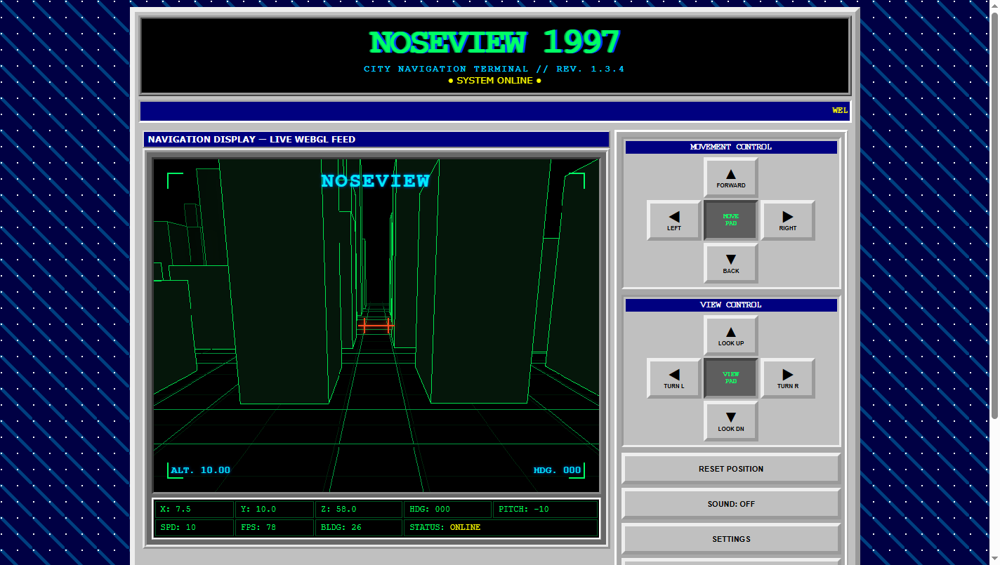
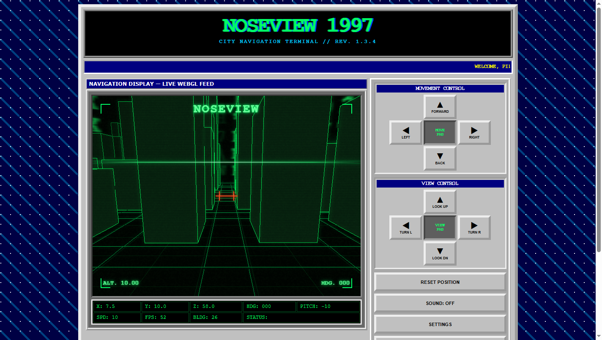

# NOSEVIEW 1997 v1.3.4 Baseline Validation

This document records the known-good behavior used as the reference for the
architecture work that follows Milestone 0. The checks were completed on
2026-07-22 before any runtime source files were changed.

## Provenance

- Runtime source commit at the start of validation:
  `7a667b3fdc0be368e232fd097716c5fd730e141f`
- Default branch: `master`
- Deployment environment: `github-pages`
- Live page: <https://bloschinsky.github.io/noseview-city-1997/>
- Stable Git reference: annotated tag `v1.3.4`

At the start of validation, local `master`, `origin/master`, and the latest
GitHub Pages deployment all resolved to the source commit above. The published
runtime files matched the corresponding Git blobs byte for byte:

| File | Bytes | SHA-256 |
| --- | ---: | --- |
| `index.html` | 7,747 | `9fdc9e21ff7329d56e351171917cd91cf651be29d144d79fbc2fe4663536f3f1` |
| `styles.css` | 13,280 | `ae0dc8bb2014a0e989356e98ceeb098bc3c9d6e9f13bb55722f52ce82f7bd15c` |
| `script.js` | 47,683 | `39090816f98b7faca8f04753e0b41c301f086e8d5b3c498f1c7ebcc34647cb5e` |

## Test Environment

| Item | Value |
| --- | --- |
| Operating system | Windows 10 Pro, build 19045, 64-bit |
| Chrome | 150.0.7871.127 |
| Edge | 150.0.4078.83 |
| Firefox | 149.0.2 |
| Desktop viewport | 1440 × 900 CSS pixels at 100% zoom |
| Mobile emulation | Chrome, 390 × 844 CSS pixels, touch enabled |
| Local launch | Direct `file:///.../index.html` navigation |

## Expected State and Controls

The initial deterministic city seed is `19810001`. It produces 26 displayed
structures and synchronized solid building and tier colliders.

| State | Expected value |
| --- | --- |
| Camera position | X `7.5`, Y `10.0`, Z `58.0` |
| Heading | `000°` / yaw `0` |
| Pitch | `-10°` |
| Speed mode | `NORMAL` |
| HUD | On |
| Analog Vision | Off |
| Digital Rain | Off |
| Sound | Off |

The status values in `script.js` are authoritative after the first UI update;
the static HTML placeholders are not part of the runtime camera state.

- `W` and `S` move forward and backward along yaw and pitch.
- `A` and `D` strafe horizontally.
- Arrow Left/Right change yaw; Arrow Up/Down change pitch, clamped to ±75°.
- The two on-screen pads provide the same movement and view commands through
  Pointer Events and pointer capture.
- `R` and **RESET POSITION** restore the documented camera position, yaw, and
  pitch without changing the city, speed mode, or display settings.
- `F` and the settings button cycle `NORMAL → FAST → SLOW → NORMAL`.

| Speed | Movement units/second | Turn degrees/second |
| --- | ---: | ---: |
| Slow | 5 | 42 |
| Normal | 10 | 65 |
| Fast | 19 | 92 |

**GENERATE NEW CITY** selects a new seed, rebuilds the 26 structures and their
colliders, deletes the previous WebGL city buffers, and resets the camera.
Sound is created lazily after a user gesture. Opening settings clears held
controls, moves focus to Close, traps Tab/Shift+Tab, and restores the invoking
control when closed. Escape and clicking the backdrop also close the dialog.

With `prefers-reduced-motion: reduce`, blinking and the Analog Vision beam stop
animating, Analog noise remains static, and Digital Rain draws a static frame.

## Browser Matrix

| Browser and launch mode | Coverage | Result |
| --- | --- | --- |
| Chrome 150, local `file://` | Full checklist, WebGL, keyboard, pointer, collisions, regeneration, focus, sound, screenshots | PASS |
| Chrome 150, emulated mobile | 390 × 844 two-column controls and emulated touch movement | PASS |
| Chrome 150, reduced motion | Media emulation, static beam/noise and enabled effect states | PASS |
| Edge 150, GitHub Pages | WebGL, initial state, keyboard movement, settings, Analog Vision and Digital Rain | PASS |
| Firefox 149, local `file://` | WebGL/default-state rendering and desktop layout visual review | PASS |
| Physical Android, iOS, and Safari | Not available in the baseline environment | NOT RUN |

Interaction checks used real animation timing and trusted pointer/touch input
where user activation matters. The resulting desktop screenshots were also
reviewed visually for a populated canvas, readable HUD, intact controls, and
absence of the WebGL failure panel.

## Manual Checklist Results

| Scenario | Result and evidence |
| --- | --- |
| City renders 26 structures | PASS — `BLDG: 26`, WebGL failure panel hidden |
| `W/A/S/D` movement | PASS — each axis changed in the expected direction |
| Arrow-key view control | PASS — heading and pitch changed in both directions |
| On-screen pointer/touch controls | PASS — desktop pointer and emulated touch both moved forward |
| Reset | PASS — restored `(7.5, 10.0, 58.0)`, `000°`, `-10°` |
| Speed cycle | PASS — `FAST 19`, `SLOW 5`, `NORMAL 10` |
| City regeneration | PASS — rendered view changed, count stayed 26, camera reset |
| Wall collision | PASS — forward movement stopped at approximately `(15.7, 10.2, 37.2)` |
| Rooftop collision | PASS — descent stopped at Y `18.5` over the deterministic front-right building |
| HUD, Analog Vision, Digital Rain, Sound | PASS — each toggle changed its state; sound enabled after a trusted click |
| Settings focus | PASS — initial focus, wraparound, Escape close, and focus restoration verified |
| Reduced motion | PASS — blink/beam animations disabled and Analog noise stayed static |

## Reference Screenshots

### Default state

### Analog Vision and Digital Rain

